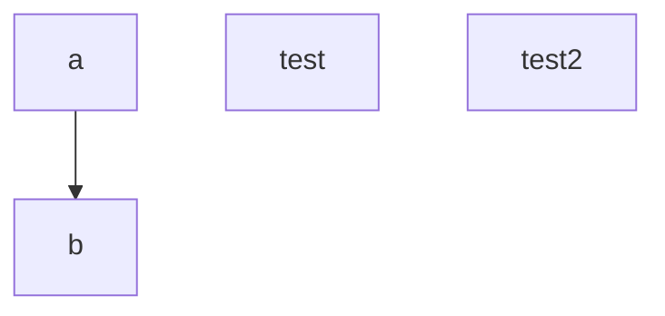

# VS Code Settings

In this project, I will store my VS Code settings.

- Basic setting files: `settings.json`
- Keybinding setting files: `keybindings.json`
- Snippet setting files: `snippets/***.json`

## Setup

### MacOS

```sh
git clone https://github.com/shunya-sasaki/vscode-settings.git ~/Library/Application\ Support/Code/User
```

### Windows

```ps1
cd $Env:APPDATA\User
git pull https://github.com/shunya-sasaki/vscode-settings.git
```


